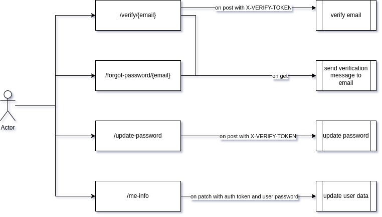

# Authorization service

#### Micro service responsible only for storing and modifying user data, as well as for user authorization and registration


Running requires:

* Python 3.11 (tested under Python 3.11.5)

---
> :required: Create a `.env` file next to `config.py` and `.env-example` and fill it in like the example in `.env-example`

```filepath
    kaimono_auth  <- Base dir
    ├── ...
    ├── api   
    │   └── ...
    ├── config.py
    ├── .env          <- here    
    ├── .env-example
    └── ...
```

**Install dependencies**:
```bash
pip install -r requirements.txt
```

**Run tests**
> :warning: **in order for the tests to work correctly, redefine USE_TEST to True in the .env file**
> also after the tests have been checked you will need to return to the False state
```bash
python3 -m tests
```

**Run falcon app**:
```bash
python3 -m api
```
---

### User update operations


> - **X-VERIFY-TOKEN** - 
> This is a token header that is sent to the user's email with url to follow it for further verification of the user,
> the token itself is intended only for updating the user's password and also for marking the user's email as verified. 
> If you use this token in the authorization header, an error will be returned,
> and the authorization token cannot be used in the X-VERIFY-TOKEN header